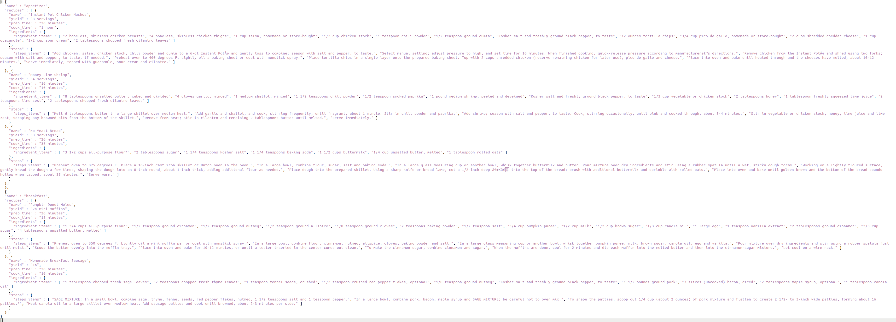
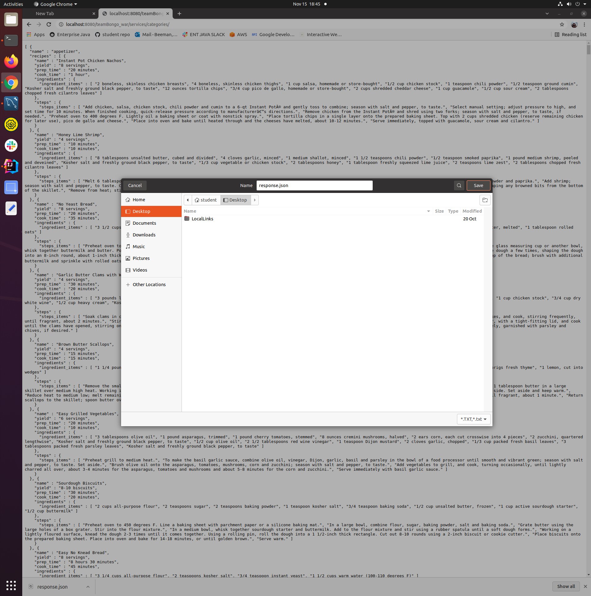
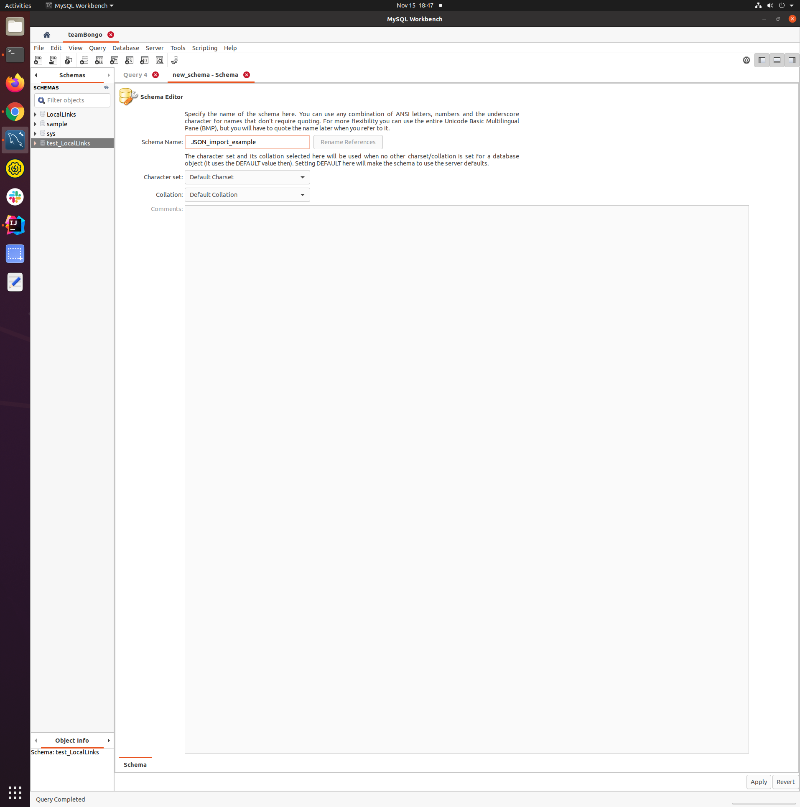
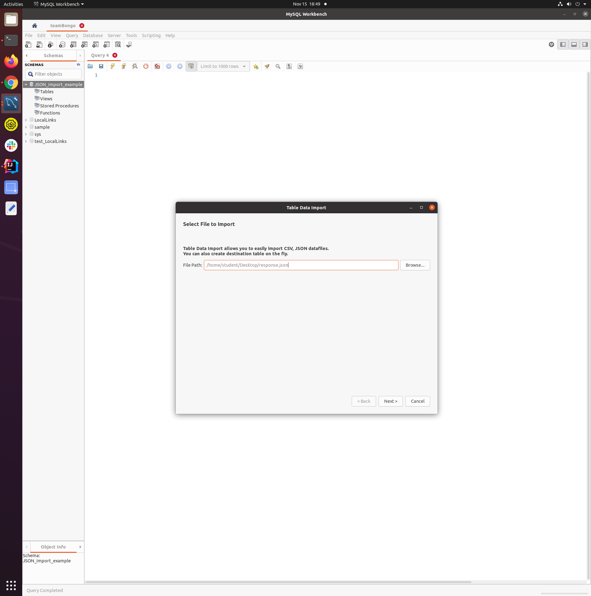
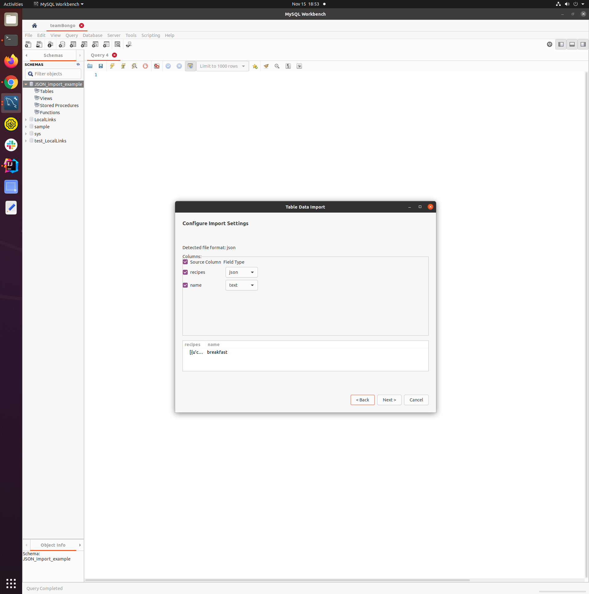
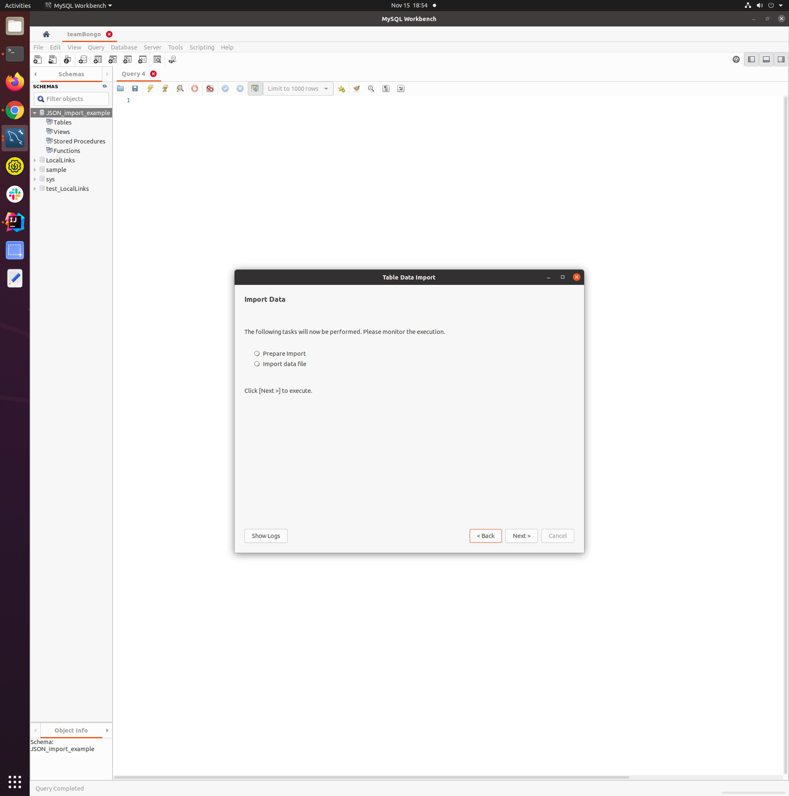
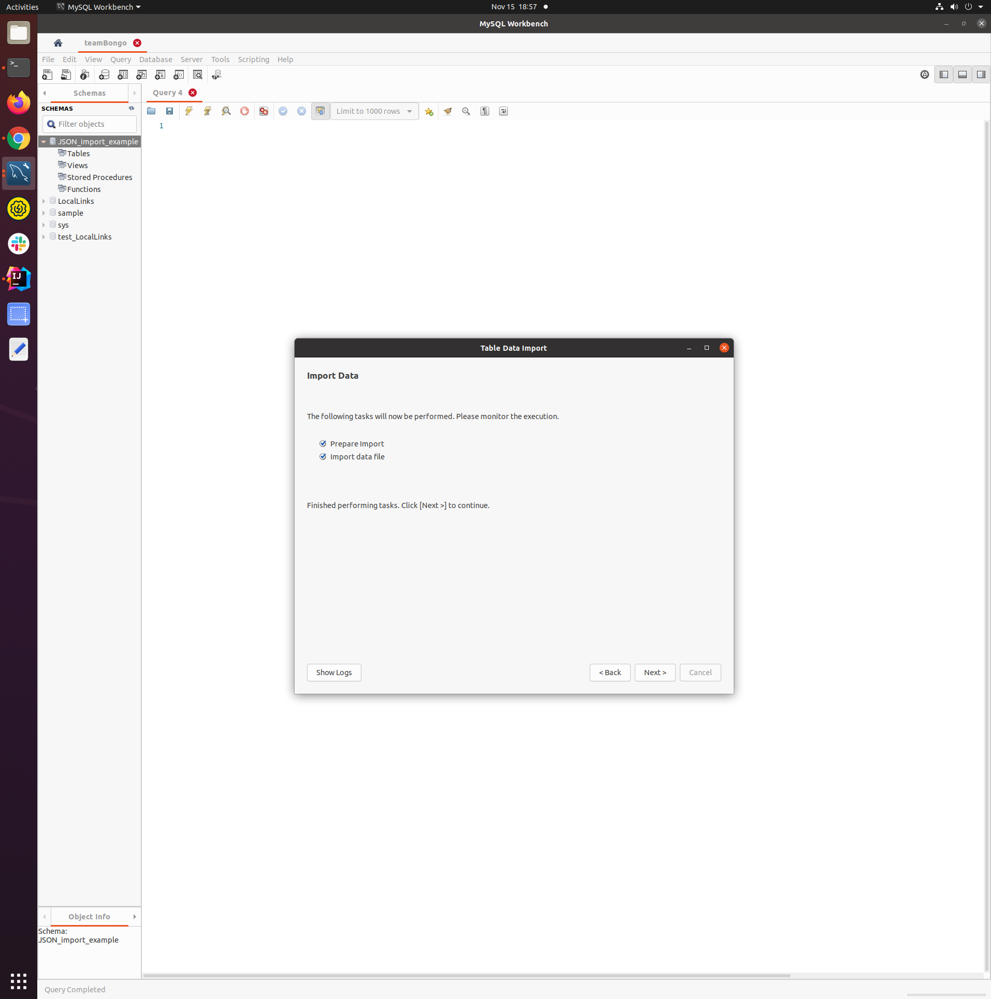
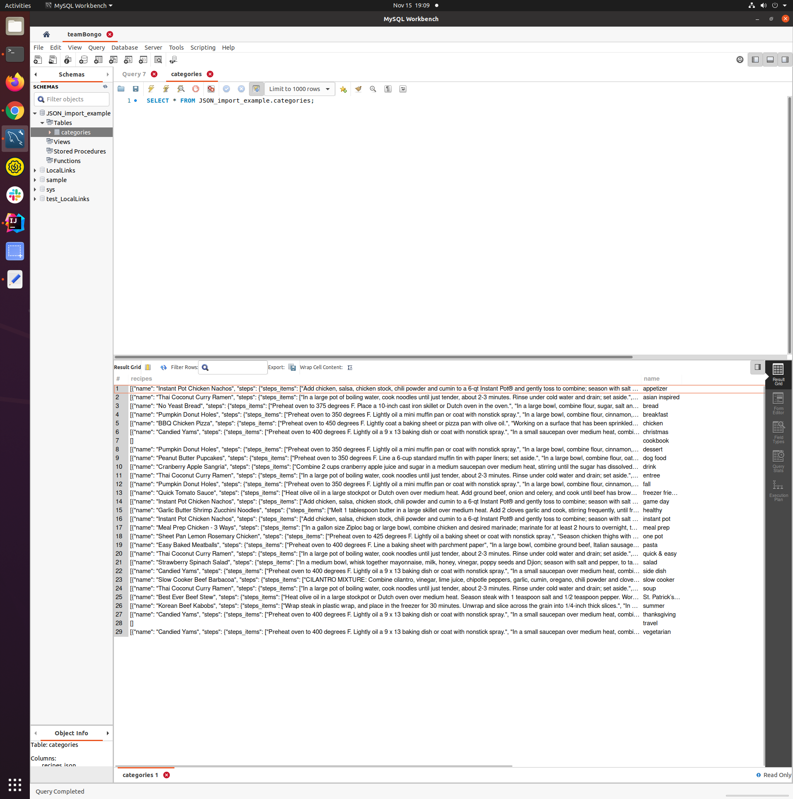

# Get By Categories Documentation
- Retrieval time ~ 10 minutes
- Usage: Database Storage
- Responses: 2 types 
  - .../services/categories/
    - ALL Categories and corresponding recipes
  - .../services/categories/{category-name-parameter}
    - ONE category and corresponding recipes

Although this method of data retrieval takes several minutes to process, the main application for it is to easily create
JSON output that can be saved to a .json file that is then used to create database tables filled with rows of data.  The following two use cases are detailed below and example JSON is provided.  

At the bottom of this document is a step-by-step tutorial that uses a response to map/populate a database in MySql Workbench

 
Example JSON output: 

## Instructions to import JSON response into MySql Workbench

### Step 1 : Save Response to .json file

### Step 2 : Create New Schema

### Step 3 : Browse and find the .json file

HINT: Right click on schema and choose 'Table Data Import Wizard'

### Step 4 : Name the table

### Step 5 : Select desired Columns to map

### Step 6 : Finish Import and examine the new table

 

 

