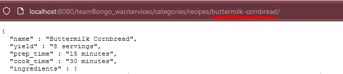

# Get By Recipe

- Retrieval Time: 1 to 2 Seconds
- Usage: scraping relevant recipe information for a single recipe and converting it to JSON.
- Responses: 1 type
    .../services/categories/recipes/{recipe-name-parameter}
 

This method of data retrieval returns a single recipe in JSON format. The recipe includes the recipe name, yield, preptime, cooktime 
ingredients needed, and directions. A usage case may be if you're browsing recipes on the site and want to quickly get the relevant
information into a machine read-able format. From there you can quickly import it to any program or database. 

Usage Example and JSON output:  

#### JSON Output

